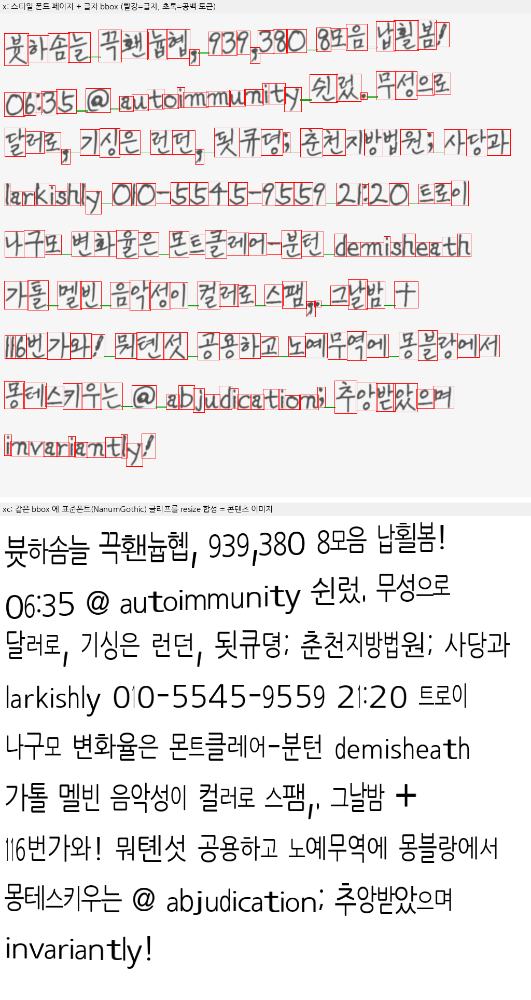
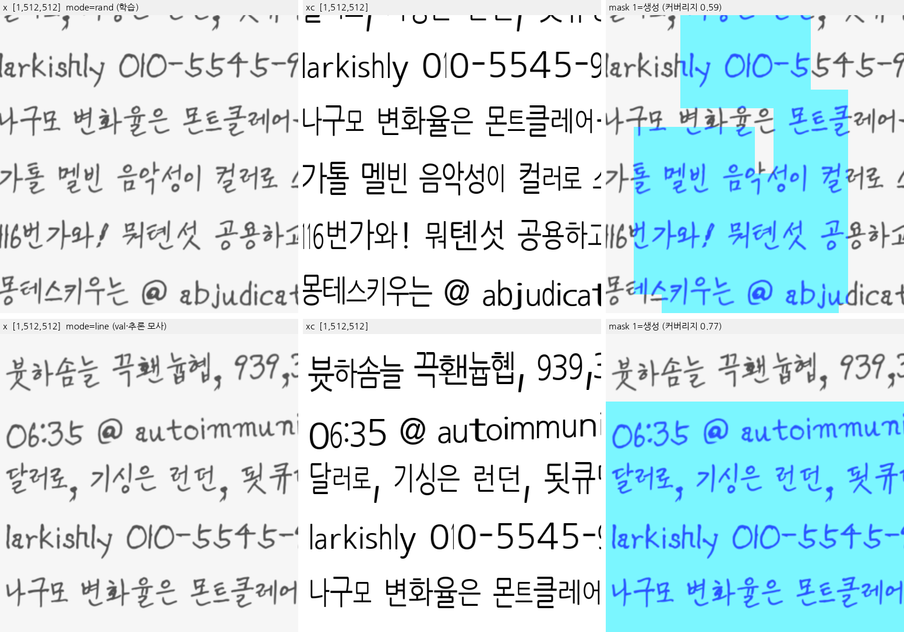
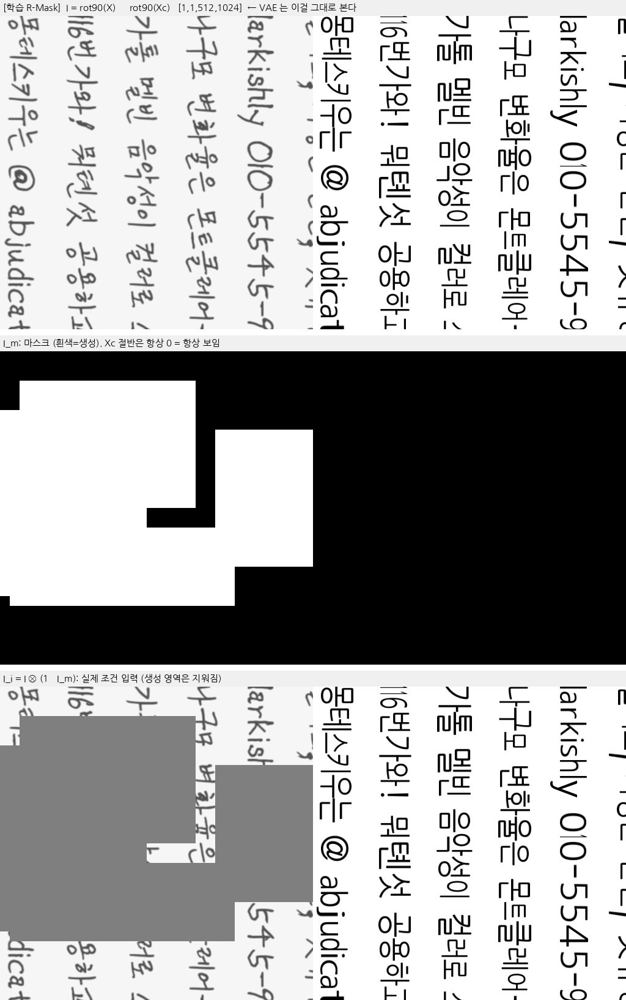
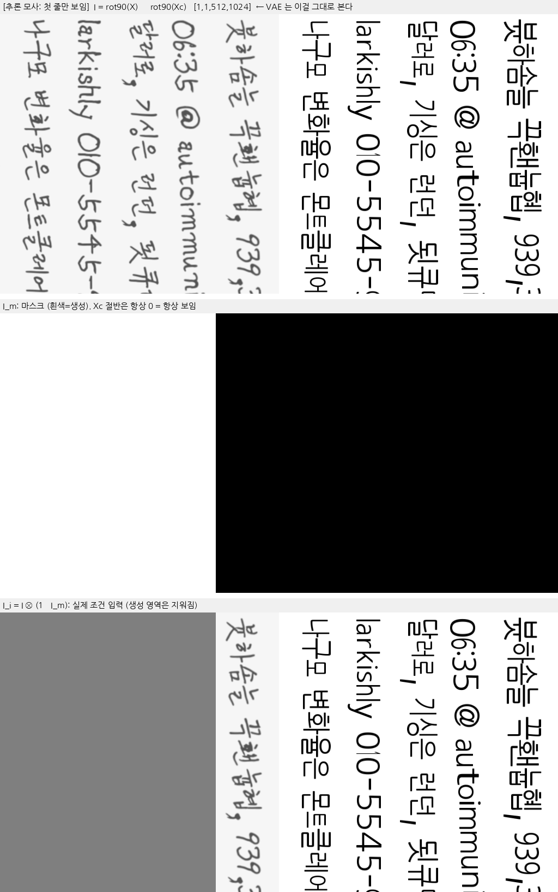
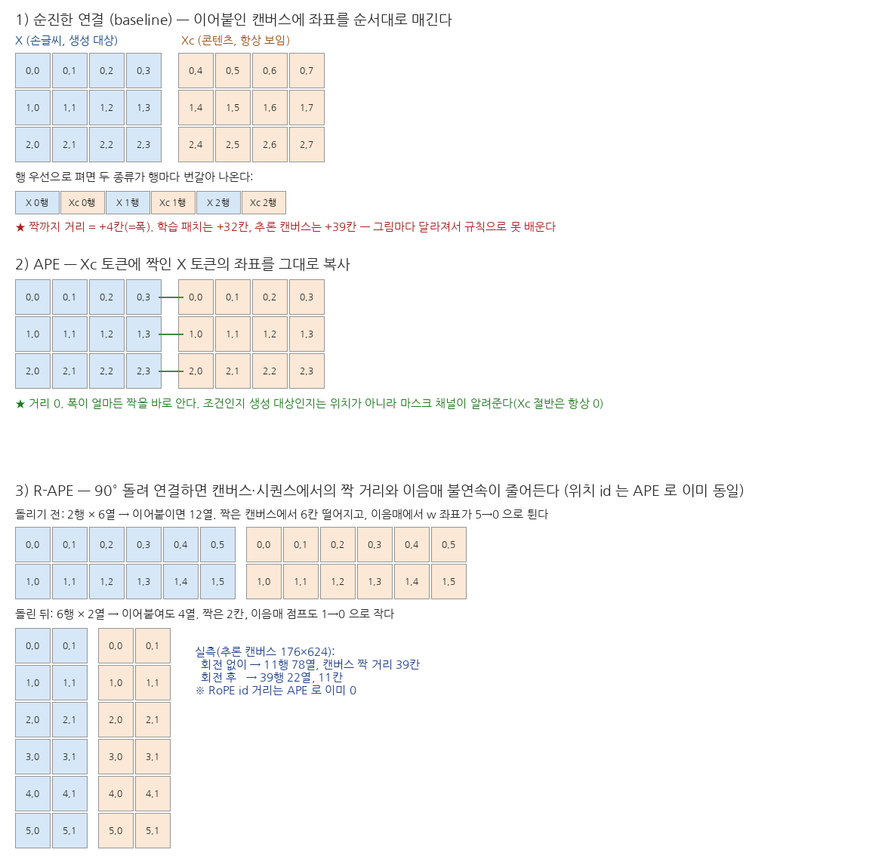
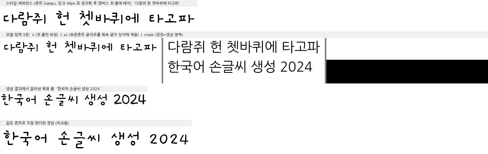

# InkSpire 한글 재현 — 구현 내용 · 이슈 · 코드 위치

논문: *Learning to Generate Stylized Handwritten Text via a Unified Representation of Style, Content, and Noise*
(Wang et al., ICLR 2026, OpenReview `FBPuLChGNX`, 사본 `docs/inkspire.pdf`). 코드 미공개라 논문만 보고 구현했다.
브랜치 `inkspire` (2026-09-10~). 측정값·재현 커맨드는 [`EXPERIMENTS.md` §12](EXPERIMENTS.md#12-inkspireflux-fill-lora--레이아웃-cfm-한글-재현-2026-09),
설계 근거는 계획 파일(`~/.claude/plans/functional-inventing-lovelace.md`).

★ 논문 표 2·3 은 HWT/VATr/One-DM/DiffPen/TGC-Diff 와만 비교한다. **Eruku/Emuru 와의 직접 비교 수치는 논문에 없다.**
"Eruku 보다 좋은가"는 §12 표(같은 HTR CER 프로토콜)로만 판정한다.

---

## 1. 논문 요약 (구현에 필요한 것만)

두 단계 분해 p(X, Xc | C, Xs) = p(Xc | C, Xs) · p(X | Xs, Xc).

| 단계 | 내용 |
|---|---|
| ① 레이아웃 p(Xc \| C, Xs) | 글자마다 bbox b=[w, h, Δx, Δy] (페이지 폭 정규화). Masked Modeling + Conditional Flow Matching 이 최선(표 1). 10층 transformer, hidden 512, 8 heads, v-prediction L1, 10-step ODE. 마스킹 = 연속 구간 / 토큰별 20% 각 50%. 추론 시 첫 줄 = 레퍼런스. 예측 bbox 에 **표준 폰트**로 콘텐츠 이미지 Xc 렌더. |
| ② 이미지 p(X \| Xs, Xc) | **FLUX.1-Fill-dev** + LoRA r=32/α=32 (115.9M, 표 8). 텍스트 인코더 제거. I = X ⓒ Xc(공간 연결), 마스크 영역만 CFM 손실(식 10-11). **R-APE**: X·Xc 를 90° 회전 후 연결, Xc 토큰의 RoPE 위치 id = 대응 X 토큰과 동일. 학습 = 페이지에서 P×P 패치 + R-Mask(랜덤 다중 사각형). Prodigy lr 1, batch 4, 20k iter. 추론 20 ODE step. |
| 추론 | one-shot: 스타일 한 줄을 첫 줄에 두고 아래 줄을 마스크, Xc 에 목표 텍스트 → 여러 줄 동시 생성. 편집 = 마스크만 변경. |

---

## 2. 우리 설정에서의 설계 결정

| 항목 | 결정 | 이유 |
|---|---|---|
| 데이터 | Eruku 와 같은 **합성 폰트 페이지**(`fonts_korean_v3/train` 12,951종). 글자별 bbox 는 렌더 시 공짜 | 실손글씨 페이지+레이아웃 라벨이 없음 |
| 패치 P | 기본 512 (1024 옵션) | 단일 GPU. 64px 라인 기준 512 에 6~8줄 |
| 콘텐츠 폰트(Xc) | **NanumGothic-Regular**(`assets/fonts_label/NanumGothic-Regular.ttf`). `configs/inkspire.yaml data.std_font` / `configs/infer.yaml inkspire.std_font` 로 노출, 학습·추론이 같아야 한다. 스타일 폰트 풀에서는 `exclude_fonts: [NanumGothic]` 으로 제외 | 라벨 렌더에 이미 쓰던 자산(신규 자산 없음). 표준폰트가 스타일로 다시 나오면 과제가 복사로 퇴화 |
| 텍스트 인코더 | 빈 프롬프트 임베딩 1회 캐시 → 학습·추론에 T5-XXL/CLIP 미탑재 | 논문: 텍스트 인코더 제거. 0 벡터가 아니라 실제 빈 프롬프트 임베딩이어야 백본이 분포 안에서 시작 |
| guidance | 30 고정(학습=추론) | Fill-dev 인페인팅 동작점. 텍스트가 없으니 상수 조건 스칼라, train/infer 동일성만 중요. 논문 미기재 |
| 레이아웃 모델 | Masked+CFM 만 구현(AR/Masked 변형 생략) | 표 1 에서 열세 |
| 논문 편차 | `line_emb` 추가, additive t(adaLN 아님), t~U(0,1), 10% 무레퍼런스 마스킹 | 코드 내 `ponytail:` 주석 참고. 무레퍼런스 모드는 레이아웃 라벨 없는 실손글씨 추론용 |
| 단계 게이트 | 데이터 → 이미지 모델(oracle 레이아웃) → 레이아웃 모델 → 통합 추론·Eruku 비교 | 이미지 모델 성패를 레이아웃 오차와 분리 |

---

## 3. 코드 위치

### 신규 파일

| 파일 | 역할 | 핵심 심볼 |
|---|---|---|
| `custom_datasets/korean/page.py` | 페이지 렌더러 + 두 데이터셋 | `render_line` :91 (글자별 bbox, 공백=h 0 토큰) · `render_content` :136 (표준폰트 글리프를 bbox 에 resize 합성 = Xc, 추론 공용) · `render_page` :173 (줄 단위 ±3° 회전 → 페이지 단위 elastic/morph/blur/배경/jitter, `fontset.py` 재사용) · `layout_seq` :229 / `layout_to_bboxes` :243 (Fig 2 파라미터, bbox 만으로 역변환) · `vocab` :259 / `char_ids` :270 (2,511 = pad, unk + `alphabet.load_charset()`) · `rmask` :277 (1~4 사각형 합집합, 16px 격자 스냅, 커버리지 [0.15,0.85]) · `line_mask` :295 · `KoreanPageDataset` :307 (`mode=rand|top|line` → `{x, xc, mask}` [1,P,P]) · `KoreanLayoutDataset` :384 (`MAX_TOKENS` 캡) · `layout_collate` :402 |
| `models/inkspire.py` | FLUX-Fill LoRA 이미지 모델 | `LORA_TARGETS` :49 (표 8 13종, full-match 정규식) · `load_flux` :87 · `empty_prompt_cache` :101 · `build_inputs` :129 (R-APE 회전, X\|Xc 연결, VAE 인코딩, FluxFill 마스크 패킹, APE id 타일, `loss_mask`) · `cfm_loss` :165 (식 10-11, logit-normal σ + 해상도 shift) · `generate` :179 (Euler ODE → X 절반 역회전 → 비마스크 픽셀 보존) · `save_lora` :95 |
| `models/inkspire_layout.py` | 레이아웃 CFM 모델 | `LayoutCFM` :33 (char/pos/line/obs 임베딩 + layout_proj + t_mlp, `mean/std` 버퍼 → `set_norm` :57 필수) · `make_gen_mask` :83 · `cfm_loss` :109 (마스크 토큰 v-pred L1) · `sample` :128 (마스크 토큰만 Euler, 관측 토큰 bit-identical) · `save_ckpt` :147 / `load_layout` :154 |
| `train/inkspire.py` | 이미지 LoRA 트레이너 | `make_parser` :45 → `configs/inkspire.yaml` · `main` :91 (Prodigy/AdamW, grad-accum, clip, bf16 autocast, val = `mode=line` 고정 배치 + `generate` 그리드 PNG, `lora_step_%06d/{pytorch_lora_weights.safetensors, trainer.pt}` + `lora_last` 심링크, `--resume <lora_dir>`) |
| `train/inkspire_layout.py` | 레이아웃 트레이너 | `make_parser` :37 → `configs/inkspire_layout.yaml` · `validate` :77 (val loss + `sample` 의 bbox L1 px) · `main` :91 (step 0 `set_norm`, AdamW, `checkpoint_step_%06d.pth`/`checkpoint_last.pth`) |
| `infer/inkspire.py` | one-shot 생성기 + 뷰어 | `InkSpireGen` :71 — `prepare` :86 (ref 잉크 48px 로 정규화, 레퍼런스 bbox = 표준폰트 렌더를 ref 폭으로 스케일, 레이아웃 모델 `sample` 또는 std layout, 줄마다 좌측 여백 고정, 2줄+ 캔버스·Xc·마스크 구성) · `gen_lines` :153 · `gen` :166 (Eruku `gen_from_style` 과 같은 계약) · CLI `main` :177 (`--lines a b c` 다중 줄, `--dry-run` 캔버스만) |
| `tools/fetch_flux.py` | FLUX 34GB 1회 다운로드 + 빈 프롬프트 캐시 `model_zoo/flux_fill_empty_prompt.pt` | 로그인/라이선스 미완이면 한글 안내 후 exit 1 |
| `configs/inkspire.yaml`, `configs/inkspire_layout.yaml` | 조절 가능한 전부(paths 4키는 `base.yaml` 상속 불가라 복제) | |

### 수정 파일

| 파일 | 변경 |
|---|---|
| `infer/show.py` :137, :197 | `load_model("inkspire:<lora_dir>[,<layout_ckpt>]")` 디스패치(지연 import) + `gen_from_style` 이 `.gen` 있는 모델은 그대로 호출 → `experiments/gen_compare.py` (및 원본 repo 의 `eval/htr_cer.py`) 무수정으로 두 백엔드 비교 |
| `configs/loader.py` :46 | `PATH_KEYS` 에 `empty_cache`, `lora_dir`, `layout_ckpt` |
| `configs/eval.yaml`, `configs/infer.yaml` | `inkspire:` 섹션 |
| `train/core.py` | `log_run_config` 추출(두 신규 트레이너가 import) |
| `train.sh` / `inference.sh` / `eval.sh` | `inkspire`, `inkspire-layout`, `fetch-flux` / `inkspire` / 헤더 안내 |
| `pyproject.toml` | `peft>=0.18`, `prodigyopt>=1.1` |
| `README.md`, `docs/EXPERIMENTS.md` | repo 구조 트리, §12 |

### self-check (전부 통과, 2026-09-10)

```bash
.venv/bin/python custom_datasets/korean/page.py --out /tmp/kpage --n 4        # bbox 왕복·shape·마스크·xc 잉크·collate, PNG 덤프 (~33s)
.venv/bin/python models/inkspire.py --smoke                                     # tiny 모델, 다운로드 없음 (~5s)
GPU=2 .venv/bin/python models/inkspire.py --smoke --with-weights                # trainable == 115,912,704, peak VRAM
.venv/bin/python models/inkspire_layout.py --smoke                              # 마스크 규칙·샘플러·과적합·ckpt 왕복
GPU=2 ./train.sh inkspire-layout --out finetune_runs/inkspire_layout_smoke --max-steps 2 --batch-size 4 --num-workers 0 --norm-batches 1 --val-every 1 --val-batches 1 --save-every 1
GPU=2 ./train.sh inkspire --out finetune_runs/inkspire_smoke --max-steps 2 --batch-size 1 --P 256 --num-workers 0 --val-every 1 --val-batches 1 --val-steps 2 --save-every 1
GPU=2 ./inference.sh inkspire --dry-run --layout-ckpt <ckpt> --lines "첫 줄" "둘째 줄" --out _debug/inkspire_dry.png
```

---

## 4. 검증된 사실 (구현 중 확인)

- 표 8 의 LoRA 대상 이름은 diffusers 모듈명 그대로(`ff.net.2`, `norm1.linear`, `norm.linear`). r=32 로 계산한 합이 **115,912,704 = 논문 115.91M** 과 정확히 일치 → 매핑은 항등. 단, suffix 매칭이면 최상위 `transformer.proj_out` 까지 잡히므로 full-match 정규식이어야 한다.
- diffusers 0.38: `load_lora_adapter` 는 `use_safetensors=True` 와 `adapter_name="default"` 를 명시해야 resume 후 `save_lora_adapter` 가 동작한다(없으면 `default_0` 로 등록되어 저장 실패).
- transformer 는 timestep·guidance 를 내부에서 ×1000 → σ∈(0,1] 그대로 넘긴다. `img_ids` 는 2-D [L,3].
- APE 검증 포인트: 토큰은 행 우선이라 X/Xc 가 행마다 교차한다. `ids.view(hh, 2ww, 3)[:, :ww] == [:, ww:]` 가 맞는 불변식이고 `ids[:L/2]==ids[L/2:]` 는 아니다.
- grad checkpointing 게이트는 `torch.is_grad_enabled()` (train() 여부 무관). `generate` 는 no_grad.
- 실측: P=512 B=4 → 2,048 토큰(+txt 512), **2.6 s/step, peak 30.6GB** → 20k step ≈ 14.5h (계획 7~9h 과소). P=256 B=1 fwd+bwd 23.5GB.

---

## 5. 이슈 로그

| # | 증상 | 원인 | 조치 |
|---|---|---|---|
| 1 | OpenReview pdf/forum/API 전부 403 | 이 서버 → Cloudflare 브라우저 검증 | 사용자가 PDF 를 `docs/inkspire.pdf` 로 넣음 |
| 2 | FLUX.1-Fill-dev 다운로드 불가 | 게이트 repo + **비상업 라이선스**, 미로그인 | `hf auth login --token …` + 모델 페이지 라이선스 수락 → `./train.sh fetch-flux`(34GB). 릴리즈 시 라이선스 주의 |
| 3 | 레이아웃 학습 첫 배치 `AssertionError: N=1049 > max_len=1024` | pitch≈42px·page_w 1024 페이지가 1,000+ 토큰 | `KoreanLayoutDataset.MAX_TOKENS` 로 줄 경계 캡, 모델 `max_len` 2048 |
| 4 | 레이아웃 학습이 GPU **76GB** 점유 | batch 160 × 최대 2,048 토큰의 attention·FFN 활성화 | `MAX_TOKENS` 1024 로 캡(초과는 극단 pitch 뿐). 그래도 이미지 run 과 동시 실행 시 83GB·이미지 속도 반토막 → **s8000 에서 중단**, 이미지 학습 후 `--resume` |
| 5 | 레이아웃 학습 속도 0.94 it/s (계획 "40분" → 실제 6h) | 페이지 렌더가 CPU 병목 | val bbox L1 이 s2000 부터 11~12px 정체(val loss 는 하강) → 20k 필요성 의문, s8000 사용 중 |
| 6 | 추론 시 생성 줄이 오른쪽으로 누적 밀림 | 줄 시작 Δx(= −이전 줄 폭)를 모델이 가장 못 맞춤. 학습 줄은 page_w 를 채우지만 추론 줄은 짧음 | `infer/inkspire.py prepare`: 줄마다 첫 토큰을 좌측 여백으로 평행이동(학습 페이지는 전부 좌측 시작). 크기·간격은 예측값 유지 |
| 7 | 배경 대기 셸이 "low on memory" 로 반복 종료 | 하네스 자체 제한(머신 RAM 은 685GB 여유) | `Monitor` 로 대체. 학습 프로세스엔 영향 없음 |
| 8 | `pkill -f <패턴>` 이 대기 셸 자신까지 죽임(exit 144) | 패턴이 자기 커맨드라인에도 매치 | `pgrep -f "^/data/.*python train/…"` 처럼 실행 경로로 앵커 |
| 9 | `_with_weights` 스모크 OOM | 당시 레이아웃 트레이너가 GPU 2 의 76GB 점유(이슈 4) | 레이아웃 중단 후 재실행 → 통과 |

미해결/관찰:
- **숫자가 가장 약하다**(s1000 몽타주에서 "2026" → "2020"/판독불가). 학습 진행에 따라 재확인.
- 레퍼런스 레이아웃은 근사다(표준폰트 렌더 bbox 를 ref 폭으로 스케일). 실제 글리프 위치와 다르므로 결과가 나쁘면 std layout(`--layout-ckpt` 생략) 수치와의 차이로 원인을 분리한다.
- 평가 텍스트(`eval_lines_ko.txt`)와 학습 코퍼스의 어절 단위 중복은 기존 repo 관례 그대로.
- `docs/inkspire.pdf`(12MB) 커밋 여부 미결정.

---

## 6. 진행 상태 (2026-09-11 16:00 기준)

| 항목 | 상태 |
|---|---|
| 이미지 LoRA `finetune_runs/inkspire_p512` | **완료** 20,000 step (val loss 0.193 → 0.168, 평균 0.27 it/s, peak 30.6GB). `lora_last` = `lora_step_020000` |
| 레이아웃 `finetune_runs/inkspire_layout` | s8000 에서 중단(val bbox L1 11.7px). **재개할 이유가 약함** — 아래 결과에서 레이아웃 모델이 std layout 보다 나쁨 |
| Stage 4 평가 | 3 세트 × {std layout, +layout} × {echo, style-ref} n=300 완료 → `finetune_runs/_eval/inkspire_s20000_*.txt`, 표는 EXPERIMENTS §12 |
| 판정 | **Eruku 우세.** held-out style-ref 중앙값 Eruku 0.000 / 폭주 0.0% vs InkSpire 최고(s13000) 0.190 / 1.7%. 전 세트 동일 방향 |
| 최적 체크포인트 | **s13000**(0.190) > s20000(0.222). val loss 는 s20000 이 최저 — 손실로 고르면 틀린다 |
| 레이아웃 모델 기여 | **음(−)**. 6 쌍 전부 std layout 이 같거나 나음. n=40 중간 점검의 반대 결과는 표본 착시였음 |
| 약점 | 붓글씨류 폰트(NanumBrushScript 중앙값 0.442, 폭주 16.7%), 숫자 오류가 전 구간 최다 |

### 남은 선택지 (하려면)

| 후보 | 근거 | 비용 |
|---|---|---|
| P=1024 재학습 | 논문 설정. 지금 가장 큰 편차이고 논문 A.5.4 가 해상도 축소의 손해를 지적 | 20k step, 배치 2, 약 30h |
| 레이아웃 20k 완주 | bbox L1 이 s2000 부터 정체라 기대값 낮음. 지금은 std layout 이 더 나음 | 6h |
| 숫자·붓글씨 보강 | 코퍼스 숫자 비중 상향, 붓글씨 폰트 가중 샘플링 | 데이터만 수정, 재학습 필요 |

재현 커맨드는 `docs/EXPERIMENTS.md` §12 에 있다.

---

## 7. 모델 입출력 — 무엇이 들어가 무엇이 나오고 손실이 어떻게 계산되나

그림은 실제 코드 경로(`KoreanPageDataset` → `build_inputs`, `KoreanLayoutDataset` → `layout_collate`)를 그대로 돌려 만든 것이다.
재생성: `PYTHONPATH=. .venv/bin/python docs/_gen_inkspire_io.py` → `docs/img_inkspire_io/` + `numbers.json`(아래 수치의 출처).

### 7.1 Stage 1 — 레이아웃 CFM (`models/inkspire_layout.py`)



한 페이지가 곧 한 샘플이다. 위 그림의 페이지는 9줄·240 토큰(공백 포함), 932×1024 px, pitch 98 px 였다.
글자 하나 = 토큰 하나이고, 토큰의 타깃은 bbox 를 페이지 폭으로 나눈 4 개 값 `[w, h, Δx, Δy]` 다
(`Δx` = 이전 글자 오른쪽 끝과의 차, `Δy` = 이전 줄 baseline 과의 차, `layout_seq` :229).

| 글자 | bbox(px) | `[w, h, Δx, Δy]` |
|---|---|---|
| 븃 | 8, 38, 55, 100 | 0.0459, 0.0605, 0.0078, 0.0371 |
| 하 | 52, 42, 94, 93 | 0.0410, 0.0498, −0.0029, 0.0410 |
| (공백) | 172, 83, 193, 85 | 0.0205, 0.0020, −0.0020, 0.0811 |

배치(`layout_collate`)는 가변 길이를 `Nmax` 로 패딩한다. 위 그림의 2 샘플 배치는 `N=281` 이었다.

| 텐서 | shape | 뜻 |
|---|---|---|
| `char_ids` | [B, N] long | vocab 2,511 (`<pad>`, `<unk>` + charset 2,509) |
| `layout` | [B, N, 4] f32 | 타깃 `[w,h,Δx,Δy]` (page_w 정규화) |
| `line_id` | [B, N] long | 줄 번호 0…, 0 = 레퍼런스 줄 |
| `ref_mask` | [B, N] bool | `line_id == 0` = 관측(조건) 토큰 |
| `pad_mask` | [B, N] bool | True = 패딩 |

한 step:

```
x0      = (layout − mean) / std            # 버퍼 mean/std, step 0 에 20 배치로 set_norm (★ 필수)
gen     = make_gen_mask(ref, pad)          # 연속구간 45% / 토큰별 20% i.i.d. 45% / 전체마스크 10%
t ~ U(0,1)[B],  z ~ N(0,I)[B,N,4]
x_t     = (1−t)·x0 + t·z
입력    = char_ids, line_id, where(gen, x_t, x0), gen, t, pad_mask
```

토큰 벡터는 6 개 임베딩의 합(512-d): `char_emb + pos_emb + line_emb + layout_proj(4→512) + obs_emb(관측/마스크) + t_mlp(sinusoid(t))`.
이걸 10층 Transformer encoder(8 head, FFN 2048, pre-LN)에 넣고 `LayerNorm → Linear(512,4)` 로 내보낸다.

- **출력** `v [B, N, 4]` — 속도 예측. pad 위치 출력은 버린다.
- **손실**(`cfm_loss` :109) — 마스크 토큰만의 v-prediction **L1**: `Σ |v − (z − x0)| · gen / (Σgen · 4)`.
- **추론**(`sample` :128) — `gen = ~ref & ~pad` 만 노이즈로 시작해 10-step Euler(t: 1→0.1), 마지막에 `denormalize`. 관측 토큰은 입력값 그대로 나온다.
- 모델 33.77M 파라미터. 배치 160(우리 실행은 128), 페이지당 최대 1,024 토큰(`KoreanLayoutDataset.MAX_TOKENS`).

### 7.2 Stage 2 — 이미지 (FLUX.1-Fill-dev + LoRA, `models/inkspire.py`)



데이터셋은 페이지에서 P×P(=512) 패치를 뜯어 3 장을 준다. 전부 `[1,512,512] f32 ∈ [−1,1]`(mask 만 0/1).

| 텐서 | 뜻 |
|---|---|
| `x` | 스타일 폰트로 렌더한 손글씨 패치 (생성 타깃 + 스타일 조건을 겸함) |
| `xc` | 같은 bbox 에 표준폰트 글리프를 채운 콘텐츠 이미지 |
| `mask` | 1 = 생성할 영역. **학습은 `rand`=R-Mask 만 쓴다**(1~4 사각형 합집합, 커버리지 0.15~0.85, 논문 §3.3.1). `line`(첫 줄 아래 전부)은 val 전용이고 추론 마스크를 흉내낸 것이다(논문 §3.4). `top`(상단 1/8 만 보임)은 논문 §4.4.2 의 F-TopMask 어블레이션용 옵션 — 기본값 아님 |

**학습 (R-Mask, 실제 학습 경로)**



**추론 모사 (첫 줄만 보임, val 배치와 `infer/inkspire.py` 가 만드는 마스크)**



**APE / R-APE 가 무엇을 바꾸나**



토큰은 행 우선으로 펴지므로 X 와 Xc 를 가로로 붙이면 두 종류가 행마다 번갈아 나오고, 짝까지의 좌표 차이가
그림 폭에 따라 달라진다(학습 패치 +32칸, 추론 캔버스 +39칸). APE 는 Xc 토큰에 짝의 좌표를 복사해 그 차이를 0 으로 만든다.
★ 따라서 **R-APE 의 회전은 RoPE 거리를 더 줄이는 게 아니다** — APE 로 이미 0 이다. 회전이 바꾸는 것은
(a) 캔버스·시퀀스에서의 물리적 거리(추론 캔버스 39칸 → 11칸), (b) 이음매에서 w 좌표가 되감기는 폭(38 → 10),
(c) 캔버스 종횡비. 논문은 메커니즘을 설명하지 않고 표 4·5 의 수치(FID 9.31 → 7.92, ΔCER 0.05 → 0.01)로만 주장한다.
우리는 R-APE 로만 학습했고 ablation 은 안 했다(각 14h).
조건인지 생성 대상인지는 위치가 아니라 마스크 채널이 구분한다. 그림 재생성: `docs/_gen_inkspire_ape.py`.

`build_inputs` :129 가 하는 일 (그림이 각각 I, I_m, I_i):

```
rot90 시계방향 → I  = [rot(x) | rot(xc)]        [B,1,512,1024]     ← R-APE
                 I_m = [rot(mask) | 0]           (Xc 절반 마스크 0 = 항상 보임)
                 I_i = I ⊗ (1 − I_m)
VAE 인코딩       (I) → [B,16,64,128] → pack(2×2) → x0_packed   [B,2048,64]
                 (I_i) →              → pack     → masked      [B,2048,64]
mask 픽셀언셔플  I_m → [B,64,64,128]  → pack     → mask 토큰    [B,2048,256]
cond_packed = [masked ⊙ mask 토큰]                              [B,2048,320]
img_ids     = X 절반 격자(32×32)를 폭 방향으로 2회 타일           [2048,3]   ← Xc 토큰 id == 대응 X 토큰 id
loss_mask   = mask 토큰이 하나라도 1 인 토큰                       [B,2048] bool
              (Xc 절반은 항상 0 → 위 예시 R-Mask 패치 29.6%, 추론 모사 패치 39.1%)
```

transformer 입력은 `hidden_states = [x_t ⊙ cond_packed]` = **[B, 2048, 384]** (노이즈 64 + 마스크된 latent 64 + 마스크 256).
텍스트 자리에는 빈 프롬프트 캐시가 그대로 들어간다: `encoder_hidden_states [1,512,4096]`, `pooled_projections [1,768]`, `txt_ids [512,3]`.
`guidance = 30` 고정 스칼라. 출력은 **`v [B, 2048, 64]`**.

한 step (`cfm_loss` :165, 식 10-11):

```
u ~ logit-normal(0,1)                        # compute_density_for_timestep_sampling
σ = time_shift(mu, 1, u),  mu = calculate_shift(L=2048) = 0.8033
x_t = (1−σ)·x0 + σ·z,   z ~ N(0,I)
v   = transformer([x_t ⊙ cond], timestep=σ, guidance=30, 빈 프롬프트, img_ids)
loss = Σ_tok mean_ch (v − (z − x0))² · loss_mask / Σ loss_mask
```

즉 마스크된 latent 토큰에서만 v-prediction MSE 를 재고, Xc 절반과 보이는 영역은 손실에 안 들어간다. perceptual/CTC 같은 추가 손실 없음.

추론(`generate` :179)은 σ 를 `linspace(1, 1/steps, steps)` 로 놓고 20-step Euler → `unpack` → VAE 디코딩 → **X 절반만 잘라** 역회전 → `x·(1−mask) + gen·mask` 로 합성. 반환 `[B,1,H,W] ∈ [−1,1]`. 보이는 픽셀은 입력 그대로 보존된다.

### 7.3 추론 한 줄 생성 — 실제 폰트 예시



held-out 폰트 Gaegu 로 스타일 한 줄을 주고 다른 문장 한 줄을 받은 것이다(`lora_step_013000`, std layout, 20 step).
캔버스는 176×624 이고 레퍼런스가 첫 줄을 차지한다(★ 스타일 인코더가 없으므로 레퍼런스는 캔버스 위에 있어야 한다).
마스크는 그 아래 전부. 생성 후 목표 줄의 상자 범위만 잘라 리더에 넘긴다 — `gen_compare` 가 받는 것도 이 한 줄이다.
재생성: `PYTHONPATH=. CUDA_VISIBLE_DEVICES=2 .venv/bin/python docs/_gen_inkspire_infer_example.py`

**shape 요약(P=512, B=1)**

| 단계 | shape |
|---|---|
| 패치 x / xc / mask | [1,1,512,512] |
| I (회전·연결) | [1,1,512,1024] |
| VAE latent | [1,16,64,128] |
| x0_packed / cond_packed | [1,2048,64] / [1,2048,320] |
| transformer 입력 / 출력 | [1,2048,384] / [1,2048,64] |
| img_ids | [2048,3] (앞뒤 절반 동일) |

---

## 8. 논문 수치 vs 구현 수치 (차이 목록)

**일치**: LoRA r=32/α=32 및 대상 모듈 → trainable 정확히 115,912,704 (논문 "약 115.9M", 표 8) · Prodigy lr 1 / wd 0.01 / batch 4 / 20,000 iter ·
이미지 추론 20 ODE step · 레이아웃 10층 / hidden 512 / 8 head / AdamW 1e-4 / 10-step ODE · F-TopMask 비율(논문 1024 중 상단 128 = 1/8, 우리 512 중 64 = 1/8) ·
마스크 토큰만의 손실(레이아웃 L1 v-pred, 이미지 L2) · 추가 손실 없음 · 텍스트 인코더 미사용.

| 항목 | 논문 | 구현 | 이유 / 영향 |
|---|---|---|---|
| 패치 P | **1024** (§4.1.4) | **512** | H100 1장. 토큰 L 이 8192 → 2048 로 줄어 한 패치가 담는 줄 수가 절반. 논문 A.5.4 는 (패치 크기가 아니라 레퍼런스 줄 높이 정규화 얘기지만) 해상도를 줄이면 스타일 단서를 잃는다고 주장 |
| GPU / 유효 배치 | A100 40GB **4장**, batch 4 | H100 1장, batch 4, accum 1 | 논문이 batch 4 를 GPU 당인지 전체인지 안 밝힘. GPU 당이면 우리 유효 배치는 1/4 |
| 학습 데이터 | IAM(영문 13,353줄/496 writer) + CASIA-HWDB2.0-2.2(중문 52,230줄/1,019 writer), 다국어 통합. 레이아웃 라벨은 영문 어절·중문 글자 단위 | 한글 **합성 폰트 페이지** 12,951종, 글자 단위 라벨 | 한글 실손글씨 페이지+레이아웃 라벨이 없음. 논문 수치와 직접 비교 불가 |
| 데이터 증강 | **언급 없음**(실제 손글씨라 기울기·번짐이 원래 들어 있음. 논문에서 rotate 는 R-APE 의 90° 뿐) | 줄 단위 ±3° 회전 p0.5, elastic p0.7, morph p0.15, blur p0.4, 배경 합성, jitter p0.5 | 합성 폰트는 너무 깨끗해 그대로 두면 폰트 렌더를 학습한다. 부작용: 회전 bbox 는 외접사각형, elastic ≤3px 는 라벨 미반영 → 레이아웃 타깃 정확도 손해. `--aug false` 로 해제 |
| guidance | 미기재 | **30** 고정(학습=추론) | Fill-dev 동작점. ★ 3.5·10 으로 낮추면 CER 0.19 → 0.53·0.42 로 폭망(2026-09-14 실측) |
| 레이아웃 값 정규화 | 언급 없음 | 차원별 mean/std(step 0 에 20 배치) | 원값이 0.02~0.06 이라 노이즈 N(0,1) 대비 SNR 붕괴. 없으면 학습 안 됨 |
| 레이아웃 토큰 입력 | char + pos + 조건 토큰 + 노이즈 토큰 | + **`line_emb`**, `obs_emb` | `line_emb` 는 논문에 없음(줄 시작 Δx 이봉 타깃 분리용). `obs_emb` 는 Fig 10(c) 의 reference/masked 구분에 해당 |
| 레이아웃 t 분포 / 조건 부여 | 미기재 | `t ~ U(0,1)`, additive t-embedding(adaLN 아님) | 4-d 회귀엔 logit-normal·adaLN 이 과함 |
| 마스킹 모드 | 연속구간 / 토큰별 20% (각 50%) | + **전체 마스크 10%** | 레퍼런스 없는 실손글씨 추론용. 나머지 90% 는 45/45 로 논문과 동일 비율 |
| 레이아웃 학습량 | 미기재(구조만) | 20k + EMA(2026-09-14 진행) | 8k 중단본은 std layout 보다 나빴다 |
| 페이지 토큰 상한 | 미기재 | 1,024 (`MAX_TOKENS`), 모델 `max_len` 2048 | 좁은 pitch 페이지가 1,000+ 토큰을 만들어 VRAM 초과 |
| R-Mask 세부 | "랜덤 크기 다중 영역" | 1~4 사각형, 변 U(P/4, 3P/4), 16px 스냅, 커버리지 [0.15, 0.85] | 논문에 수치 없음 — 추정 |
| 이미지 σ 샘플링 | 미기재(식 10-11 만) | logit-normal + FLUX `time_shift(calculate_shift(L))` | FLUX 학습 관례. 추론 스케줄과 일치 |
| grad clip | 미기재 | 1.0 | dreambooth 관례. `--clip-grad 0` 으로 해제 |
| 텍스트 조건 | "텍스트 인코더 제거" | 빈 프롬프트 임베딩 캐시(0 벡터 아님) | 0 을 넣으면 백본이 학습 분포 밖에서 시작 |
| 추론 레퍼런스 레이아웃 | 데이터셋의 **GT 레이아웃**(§4.1.1 글자/어절 단위 주석), 같은 문단의 다른 줄을 레퍼런스로(§4.3) | 표준폰트 렌더 bbox 를 ref 폭에 맞춘 근사 + 줄마다 좌측 여백 고정 | 스타일 이미지에 bbox 라벨이 없음. ★ 이미지에서 글자를 분할해 실제 bbox 를 넣어봤으나 CER 0.20 → 0.61 로 더 나빴다(2026-09-14) |
| 추론 해상도 | 원본 해상도 유지(A.5.4) | 줄 높이 64px 고정 | ref set·HTR 입력 규약. ★ 48/64/80 실측 CER 차이 없음 — 우리 조건에선 무관 |
| 평가 지표 | FID / KID / HWD / ΔCER / CR·AR / Swin 스타일 분류기 | **HTR CER 중앙값·폭주율**만 | repo 규약. 지표 라이브러리 미설치 |

---

## 9. 성능 개선 조사 (2026-09-14) — 논문 재독 + 진단 실험

### 9.1 진단 실험 결과 (원인 분해)

| 실험 | 결과 | 해석 |
|---|---|---|
| FLUX VAE 한글 왕복 CER (줄높이 48/64/80) | **0.000 / 0.000 / 0.000** (Emuru VAE 는 0.308 / 0.037 / 0.000) | **VAE 는 병목이 아니다.** Eruku 의 한글 상한([[vae-korean-capacity]])이 InkSpire 엔 없다 — 잠재 16채널 |
| 추론 줄 높이 48 / 64 / 80 (held-out, std layout, n=150) | 중앙값 **0.188 / 0.191 / 0.189** (폭주 0.7 / 1.3 / 2.7%) | **추론 해상도는 병목이 아니다.** 높일수록 폭주만 늘어 원래 값 64 유지 |
| 오라클 레이아웃 one-shot CER (스타일 폰트 GT bbox, 페이지 캔버스, held-out 6폰트) | 중앙값 **0.088** (n=18) | 이미지 모델 자체의 상한. GT 바닥 0.026 |
| 실제 추론 (std layout, 좁은 2줄 캔버스) | 중앙값 **0.191~0.197** (n=150/300) | 오라클 대비 **+0.10 은 레이아웃·캔버스 탓** |
| 레이아웃 모델 사용 | 0.222 (더 나쁨) | 추론 시 레퍼런스 토큰이 근사값이라 조건이 틀림(아래 9.2 ①) |
| **차분 오차의 적분** (EMA s20000, held-out, 줄 평행이동 적용 후 \|x0 예측−정답\|, 2026-09-15) | 줄 안 1~3번째 **142.3px** / 4~8 43.8 / 9~15 36.3 / 16+ 46.2 px | 토큰별 Δx L1 은 9.71px 인데 `layout_to_bboxes` 가 `x0 = x1_prev + Δx` 로 **줄을 따라 적분**해 절대 위치 오차가 ~40px 이 된다. 평균 글자 폭 23.7px 의 1.5~2배 — `render_content` 가 글리프를 그 상자에 resize 해 박으므로 Xc 에서 글자가 겹치거나 빈다. **std layout 이 이기는 이유가 이것**(누적 오차 0). 차분 지표가 시각적 오차를 크게 과소평가한다 |
| 체크포인트 s13000 vs s20000 | 0.190 vs 0.222 | val loss 최저 ≠ CER 최저 |
| 레이아웃 L1 **차원 분해** (EMA s20000, held-out, 생성토큰 79,465, 2026-09-15) | 전체 w 2.11 / h 1.94 / Δx 21.71 / Δy 10.15 px | Δx 가 60% 로 보이지만 **그 56.5% 가 줄 시작 토큰(2.8%, 개당 446px)** 이다 — 읽기 순서상 줄 첫 Δx = LEFT − 이전 줄 오른쪽 끝 ≈ −(이전 줄 폭). 학습 줄은 `wrap_lines(page_w−48)` 로 −960 에 몰려 있고 추론 줄은 짧아 분포 밖 |
| 같은 분해, **줄 시작 토큰 제외** | w 2.08 / h 1.93 / **Δx 9.71** / Δy 10.08 px (평균 5.95) | `infer/inkspire.py` :126 이 줄마다 첫 토큰을 LEFT 로 평행이동해 **줄 시작 Δx 를 이미 덮어쓴다** → 추론에 실제로 쓰이는 오차는 이쪽이다. Δx 와 Δy 가 비슷하고 어느 한 차원이 지배하지 않는다. ×10³ 로 논문 표 1 과 비교하면 w 2.03(논문 4.74) · h 1.88(4.94) · Δy 9.84(**14.39**) 은 우리가 낫고 Δx 9.48(**4.74**)만 2배 나쁘다 (단 논문은 IAM/CASIA 어절·글자 라벨이라 직접 비교는 아님) |

즉 **전체 오차 0.19 ≈ 레이아웃/캔버스 0.10 + 이미지 모델 0.06 + 리더 바닥 0.03**. 이미지 모델보다 레이아웃 쪽 손실이 크다.

### 9.2 논문 재독으로 새로 확인한 차이 (§8 표에 없던 것)

① **추론 레퍼런스의 레이아웃이 논문은 GT, 우리는 근사.** 논문 §4.3 은 같은 문단의 다른 줄을 레퍼런스로 쓰고(둘째 줄로 첫 줄을, 그 다음엔 첫 줄로 나머지를), IAM·CASIA 는 어절/글자 단위 레이아웃 주석을 제공한다(§4.1.1). 우리는 스타일 이미지에 bbox 라벨이 없어 **표준폰트 렌더 bbox 를 ref 폭에 맞춰 늘린 값**을 레퍼런스 토큰으로 준다. 레이아웃 모델이 std layout 보다 나빴던 원인으로 가장 유력하다(학습·검증에서는 GT 레퍼런스를 받으므로 bbox L1 11.7px 로 멀쩡했다).

② **레이아웃 정확도 자체도 논문보다 나쁘다 — 단 줄 내부 Δx 하나 때문이다.** 논문 표 1 의 CFM 은 L1×10³ 로 Δx 4.74 / Δy 14.39 / Δw 4.74 / Δh 4.94 (평균 **7.2e-3**). 우리 s8000 은 11.7px / page_w 1024 = **11.4e-3** — 약 1.6배였다. 20k+EMA 완주 후 8.75px = 8.5e-3 으로 줄었다. 차원 분해(§9.1)에서 추론이 실제로 쓰는 값(줄 시작 토큰 제외)만 보면 평균 5.95px = 5.8e-3 이고, w·h·Δy 는 논문보다 낫고 **줄 내부 Δx 만 2배 나쁘다**.

③ **논문은 추론에서 해상도를 건드리지 않는다.** A.5.4 는 레퍼런스를 고정 높이로 줄이면 스타일 단서가 사라진다고 명시한다. 우리는 ref 잉크를 48px, 줄 높이 64px 로 강제한다(HTR 리더·ref set 규약).

④ **유효 배치가 논문의 1/4 일 수 있다.** 논문은 "batch size 4 … on four A100" — GPU 당 4 라면 전체 16. 우리는 단일 GPU batch 4, accum 1.

⑤ 논문 실패 사례(A.5.6)는 실데이터의 취소선 흔적 문제로 우리와 무관. 인코더 어블레이션(A.5.5)은 사전학습 VAE 가 최선이라는 결론이라 우리 구성과 같다.

### 9.3 우선순위 (기대 효과 / 비용)

| 순위 | 할 일 | 근거 | 비용 |
|---|---|---|---|
| 1 | **추론 레퍼런스 레이아웃을 이미지에서 직접 추출** (수직 투영·연결요소로 글자 분할 → 실제 bbox). 실패 시 무레퍼런스 모드(`ref_mask` 전부 False) 사용 | 9.2 ① — 레이아웃 모델을 쓸 수 있게 만드는 전제 | 코드 반나절, 재학습 없음 |
| 2 | **레이아웃 데이터셋의 증강을 끈다** — `KoreanLayoutDataset` 은 bbox 만 먹는데 `aug=True` 가 기본이고 트레이너에 `--aug` 플래그도 없다. ★ **Δy 대책이지 Δx 대책이 아니다** | 레이아웃 타깃에서 aug 가 바꾸는 것은 `_rotate_strip` 뿐이다(elastic/morph/blur/배경/jitter 는 `xc`·boxes 확정 후 `x` 에만 적용). 실측(2026-09-15, 기존 ckpt 를 깨끗한 val 에 평가): 평균 L1 5.95 → 5.38px, **Δy 10.08 → 8.37(−17%)**, Δx 9.71 → 9.44(−3%), 타깃 Δx std 는 137.61 로 불변. ±3° 회전은 폭 1000px 줄을 세로로만 움직인다 | 인자 1개 + 재학습 |
| 3 | 학습에 짧은 줄·가변 page_w 를 넣어 줄 시작 Δx 분포를 추론과 맞춘다 | §9.1 — 줄 시작 Δx 개당 446px. 다만 `infer/inkspire.py` :126 의 LEFT 평행이동이 이미 이 값을 버리므로 실익은 "지표가 정직해진다" 쪽 | 데이터 코드 + 재학습 |
| ? | **줄 내부 Δx 9.71px(논문 4.74 의 2배) 은 원인 미상** | 증강과 무관하고(위 −3%) 줄 시작 분포 문제도 아니다. 남은 후보: 학습량/용량, 또는 한글은 글자폭이 균일해 Δx 의 정보량 자체가 적음. **먼저 원인을 재고 손댈 것** | 진단 먼저 |
| ~~2 이전~~ | ~~20k 완주 + EMA, Δy 가중~~ | 20k+EMA 는 2026-09-14 완료(L1 9.64 → 8.75px). Δy 는 이미 논문보다 나으므로 **Δy 가중은 폐기** | — |
| 3 | 추론 캔버스를 학습 페이지에 맞추기(폭 1024 패딩, pitch 학습 분포) | 오라클 0.088 vs 실추론 0.191 의 나머지 절반 | 코드 1시간 + 평가 |
| 4 | ODE step 20 → 30~50, guidance 스윕 | 가장 싼 노브. 논문 미기재 | 평가 시간만 |
| 5 | **P=1024 재학습** | 논문 설정, 지금 가장 큰 구조적 편차 | 30h |
| 6 | 유효 배치 16 (grad_accum 4) | 9.2 ④ | 20k 에 4배 시간 |
| 7 | 학습 데이터에 짧은 줄·불규칙 우측 정렬·다양한 페이지 폭 추가 | 추론 캔버스가 학습 분포 밖 | 데이터 코드 + 재학습 |

체크포인트는 앞으로도 **val loss 가 아니라 CER 로** 고른다(§6).
